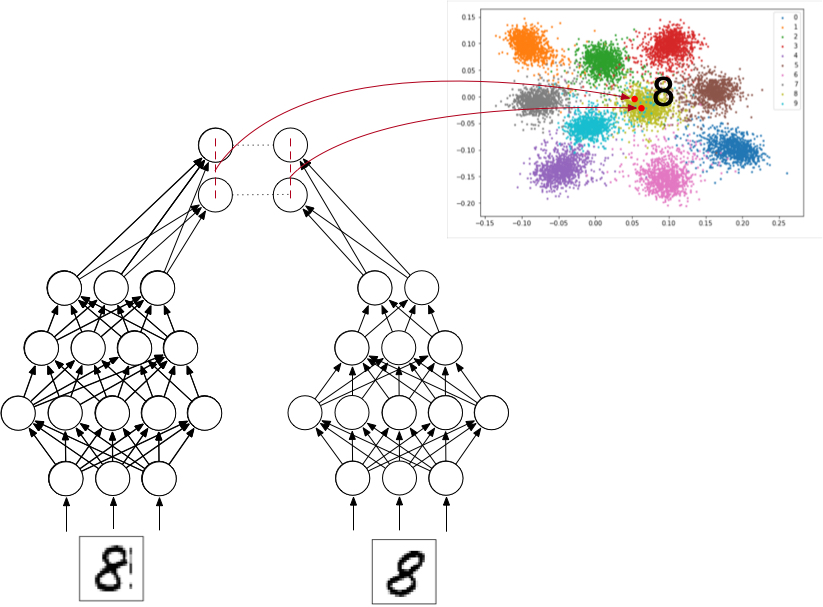
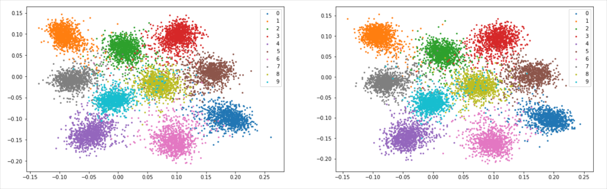
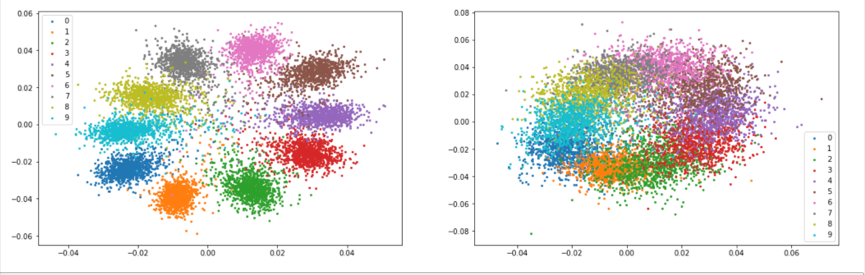
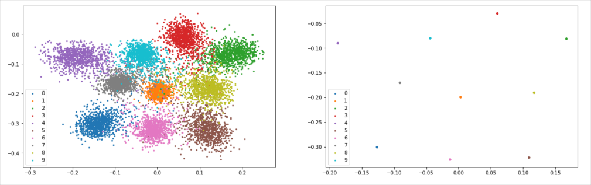
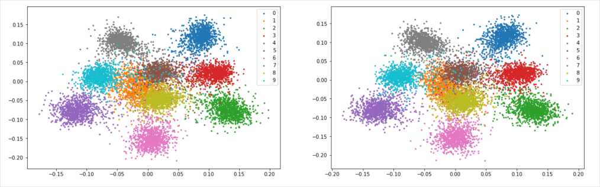

# consistent-distinguishable learning

### 0. Introduction

Machine learning is traditionally divided into unsupervised learning and supervised learning. Unsupervised learning (predictive learning) should be the right path to general intelligence. 

 Supervised learning requires a large number of samples, each of which is divided into data and label. The data may be complex structural data such as images, sounds, texts, etc., and the structure of the label is usually much simpler. Deep learning sets the loss function depending on the type of the label, and then use gradient descent method to minimise it. There are two issues that need to be mentioned: one is the need to provide a large number of manually processed samples; the other is the lack of portability of the choice of the loss function.

To solve the above dilemmas, this paper introduces a learning structure between unsupervised learning and supervised learning, called consistent-distinguishable learning. Each sample in consistent-distinguishable learning is not divided into data and label, but is divided into multiple groups (at least 2) of data. The purpose of the loss function is to require each group of data to be mapped "consistently and distinguishably" into a target vector space. "Consistent" means that different sets of data for the same sample should be mapped to vectors that are closer in distance. "Distinguishable" means that the target vectors of different samples should be distinguishable.

There have been some previous articles on learning from data pairs, dating back to 1992 when Becker and Hinton published articles on Nature. Compared with previous works, consistent-distinguishable learning has four ponits:

1. The output is in a continuous vector space
2. Prevention of degradation by local mutual exclusion mechanisms
3. No scale, no hyperparameter like "margin"
4. Anti-overfitting

Consistent-distinguishable learning has strong biological plausible. Such networks should receive more attention because they may be the basic components of general intelligence.

### 1. Network structure

The following is a description of the consistent-distinguishable network working on a pre-processed mnist data set.

The mnist data set is processed first. After processing, each sample contains two different images under the same label. In other words, convert (picture, label) pairs into (picture, picture) pairs. The number of samples under each label is not changed.

Two cnn sub-networks respectively outputting a two-dimensional vector are established, and the input is the first and the second image of a same sample, respectively. 

The output of the first network on sample \\(i\\) is \\(I\_{1i}\\). The output of the second network on sample \\(i\\) is \\(I\_{2i}\\). The batch size is \\(n\\). The loss function, which is called Consistent Loss Function(CLF), is defined as: 

$$ \sum_{i,j=1, i < j}^{n} \sum\_{k,l=1,2} e^{-\frac{\Vert I\_{ki}-I\_{lj} \Vert^2}{2 \Vert I\_{1i}-I\_{2i} \Vert^2}  }$$

No scale parameter can be found in it. CLF is not a traditional per-example surprised loss function, it's more like batch normalization. To optimize the CLF is to minimize the distance between pictures of the same sample, while maximize the distances within the whole dataset.

### 2. Result

Visualize the results of the two networks after training, on a two-dimensional plane, as below: 

The pattern of positions of numbers on the plane is random and regular in the same time. For example, the result of another experiment round is as below:

By analyzing multiple results, some rules will be found. For example, the positions of 3, 5, and 8 are always close, and the positions of 7 and 9 are always close. This is in line with the human intuitive perception that some numbers are similar in shape and are not easily identifiable.

###3. Significance

Does this kind of network have practical significance? Each sample of the mnist data set was pre-processed in this experiment. However, if the original sample is (picture, picture), then the reverse process requires more skill.

Let's look at a problem which is tricky for supervised learning. The sample is still (picture, picture) pair, but only with 50% probability the two pictures is under the same label, and there is a 25% chance that the first picture corresponds to the number+1 of the second picture(0 and 9 are treated as adjacent numbers). With another 25% probability, the first picture corresponds to the number-1 of the second picture. For such a sample, it is not easy to convert it into a supervised form of (pictures, labels), because simply determining the label set is a difficult task if without prior knowledge. After a consistent-distinguishable network is trained, the output is visualized as follows: 

The two networks are completely symmetrical. The output of the second network has no as high separation as the first network, yet the reason is not clear. However, it can be seen from the result that the consistent distinction between the networks successfully separates each number, and the arrangement of the numbers on the two-dimensional plane conforms to the previous scrambling process.

Consistent-distinguishable learning can completely mimic supervised learning. Just use the tag as data. Here is the visual output of the network trained in this way:

Also, if a certain number is excluded from the sample, such as 1, the training results are as follows. It can be found that its output position is close to the origin.

### 4. Conclusion

The characteristics of the network:

1. It can retrieve maximized common information in multiple inputs and then display it in a vector space.
2. Its presentation in vector space makes sense, and adjacent outputs usually indicate similar and less distinguishable samples.
3. If you input an untrained distribution, the output is close to the origin
4. In addition, no over-fitting has been found in all training.

### 5. Discussion

There is a lot of discussion about general intelligence and predictive learning. To develop a general artificial intelligence, its basic components must accept raw data that can be directly obtained from the outside world, and then hand over the relationship between the data itself to form abstract concepts. Consistently-distinguishable learning is an inspiring choice. In the next essay, I will give a blueprint for building a general intelligence based on consistent-distinguishable networks.