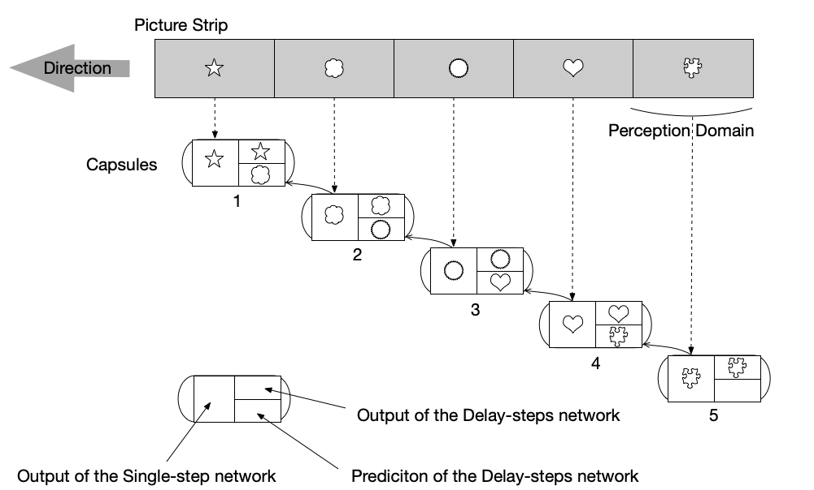

# micro-prediction capsule system
Biological plausible is the beacon to the general intelligent route. A general intelligent system should be composed of basic units, envolved through localized influences, and in a self-organization way.

This paper proposes a micro-prediction capsule system whose basic unit is the neuron capsule. The neuron capsule here differs from the capsules of the Capsule Network proposed by Hinton. Each neuron capsule contains two separate neural networks and one memory unit.

This article briefly introduces this system structure.

### 1. Neuron capsule
The neuron capsule contains a single-step neural network, at least one delay-steps network, and a memory unit.

The two neural networks can be neural networks of various structures, with output dimension alignment. The single-step neural network is calculated immediately, and the delay-steps neural network must be delayed by several computational steps. A calculation step refers to the whole calculation time of the neural network of a neuron capsule from input to output, no matter how deep the network is.

The memory unit stores serveral value-address pairs. The value is the output of a single-step neural network when certain conditions are met (actively excited), and the address is the mental space coordinate value of the system at the moment of memory formation.

### 2. Capsule excitation
There are two capsule-excitation mode: active excitation mode and memory excitation mode. 

The outputs of the two neural networks of the neuron capsule are aligned, and the two form a consistent distinguishable network structure, which is introduced by the former artical(consistent-distinguishable learning). When the output is distinguishablely-consistent with each other, the capsule is in active excitation mode. The capsule may output the output of the single-step neural network outward, and the memory unit refreshes the stored values ​​and address.

When not in the active excitation mode, the capsule may output the value stored in the memory unit, which is called a memory excitation mode.

In addition to this the output is zero. 

Excited capsules are capsules that are selected for work. The implication here is that the system will only process information that it can understand in a way that it has understood.

### 3. Connectivity and distributed optimization
The input of the two networks of the neuron capsule is independent of each other, connected to the outputs of other capsules, and some of the inputs and outputs of capsules are connected to the outside world. The connections between the capsules form a directed graph with an initial state of randomness.

Each capsule has its own Consistent Loss Function(CLF, proposed in former artical: consistent-distinguishable learning): the outputs of the two networks are identical with each other and differentiated from the outputs of the steps before the delay-steps neural network's delay. The training process uses distributed backpropagation. The back propagation of each capsule penetrates other capsules while a maximum penetration depth is necessary. So that the back propagation here is localized and distributed.

If two capsules are actively activated at the same time, there is a certain probability that they form a new connection. If an existing connection does not have an effective effect on the output, there is a certain probability of deleting the connection. You can also replace a single old network with a brand new network through a mutual-learning process.

For large-scale systems, the connections between the capsules may become very sparse due to the large number of capsules. At this point, each capsule can be assigned a fictitious position where the capsule has a greater likelihood of being connected to the surrounding capsules. Then add a network to the system that can carry signals from further capsules, which simulate the white matter of the brain.

If each capsule is dispensed in a fictitious space, it is possible to eliminate the isolation between adjacent capsules, ie there is an internal interconnection between the neural networks of the different capsules. This is more like the biological cerebral cortex because no significant separation can be found in most cerebral cortex except the visual cortex. However, this will increase the computational complexity.

### 4. Invariant expression
Micro-predictive terminology can be understood as: the delay-steps neural network predicts the output of the single-step neural network of the same capsule in advance of several steps. Virtually, the capsule attempts to retrieve same presentation from two different sources of information, and we assume that this presented information is the most useful and robust. On the other hand, if the system can know every differential change of a function, it is equivalent to learning this function.

If the continuous input from the outside world comes from the eyeball's saccade of an image, then the most effective prediction should be like this: each capsule's single-step neural network accepts pixels within a certain perceptual domain, and there are same responses to the same features between different capsules. The delay-steps neural network predicts the output of single-step neural network in the same capsule in advance, according to the output of the logically adjacent capsules and the direction of the sight movement, as is shown in the figure above. This coincides with the experimental results of the primary visual cortex of the cerebral cortex. Unlike CNN, for micro-prediction capsule systems, it is reasonable to speculate that this structure is spontaneously formed during the training process.

If you observe a rotating cube or a rotating tire, some capsules can recognize the cube and the tire, because it is useful for the prediction in other more basic visual capsules. It is reasonable to speculate that this invariant expression will be spontaneously formed during training.

### 5. Excitation relevance
The excitation between capsules is related, and capsules that are often simultaneously stimulated in history have a higher correlation. When a capsule is activated, capsules associated with it are more likely to be activated. Capsules that have been frequently actively excited in history have a higher probability of excitation. Time has two ranges, short-term and long-term. Short-term excitation relevance is what supports working-memory.

### 6. Mental space address
"From front to back, from top to bottom, from the past to the present, from the partial to the whole", and so on, these "directional" relationships indicate that the concepts should be placed in a space. On the other hand, the system should have the ability to "recursively" handle itself.

"Mental space" is a mechanism that mimics the hippocampus insprired by attention mechanism. The memory-mental-space-coordinate-value(MMSV) of the system is the mean of the address of the memory unit of all memory-activated capsules. There is a special capsule called Hippocampus Capsule(HC) whose input is the output of all other capsules, plus the periodic signals of time and space, and plus the MMSV. The output is a vector called mental-space direction(MSD). HC has only one network inside, and works like an embedding network. MSD is added to MMSV, and the sum is the current-mental-space-coordinate-value(CMSV) which represents the current attention of the system. Attention may be single-head or multi-heads. All newly formed memories use CMSV as address. Capsule has its probability of excitating memory excitation mode related to the distance between its stored address and CMSV. The shorter the distance, the higher the attention. The MMSV, the MSD, and the CMSV are also inputs to the system which will be used by other capsules.

Excitation relevance and time arrow in mental space together support declarative memory.

### 7. Critical Control
The excitation of capsules is positive feedback, which means that more capsule excitation will cause more capsule to excite. This is similar to a chain reaction. The probability that the capsules will be excited is maintained near the systems's critical state. 

The supercritical state corresponds to when thinking is active, while the subcritical state corresponds to when the training is insufficient or when multiple tasks interfere with each other.

Indicators such as the number and proportion of capsules in various states are inputs to the system which can be used by other capsules.

### 8. Long-term memory
If a capsule always stores similar content, it will solidify its memory unit and connection, and will not be overwritten by new short-term memory.

### 9. Reinforcement and motion control
The reinforcement state is a global system state. The trigger of reinforcement state is on two conditions, one is in the supercritical state, and the other is when the system achieves some artificial rewards. The reinforcement state will influence those exciting capsules by several ways, including a greater influcence on the memory, a higher probability of excitation in the future, more connections and so on.

The outputing of the system is accomplished by motion. Some capsule outputs are connected to motion control, called motion-control capsule. The consequences of the motions are received by some capsules through perception, called perception capsule. Initially, the control of motion is almost random. In the training process, the influence on perception from motion is firstly learned. A higher degree of excitation correlation is formed between the motion-control capsule and the corresponding perception capsule. The firing order of the two may be reversed at some time, so the perceptual capsule may become perception-prediction capsule. After the reinforcement process is envolved, the perception-prediction capsule can be converted into a motion intention capsule, which will control the motion-control capsule in a higher order.

